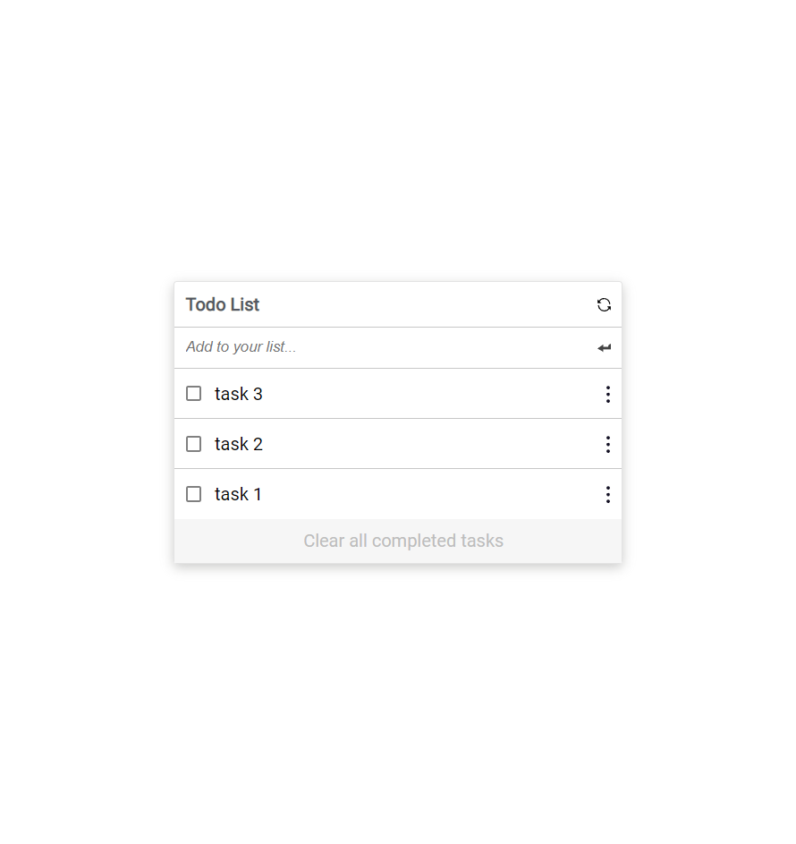

# To-Do-List

> This is a simple implementation of a todo list using the minimalist demo.



## Live Demo

[Live Demo Link](https://mirouhml.github.io/To-Do-list)

### Features implemented so far are:

## Built With

- Webhint
- Stylelint
- ESlint
- Webpack
- ES6

### Prerequisites

The basic requirements for building the executable are:

- A browser application
- A code editor
- Node Package Manager to install the packages necessary for the project

# Getting Started

#### Cloning the project

```
git clone  https://github.com/mirouhml/To-Do-list <Your-Build-Directory>
```

## Getting packages and debuging with Stylelint

```
npm install --save-dev stylelint@13.x stylelint-scss@3.x stylelint-config-standard@21.x stylelint-csstree-validator@1.x
```

##### For validation detection using Stylelint Run

```
npx stylelint "**/*.{css,scss}"
```

##### from parent source directory
## Getting packages installed
```
npm install
```

## Running the website locally
```
npm run build
npm start
```

## Author

👤 **Mirouhml**

- GitHub: [@mirouhml](https://github.com/mirouhml)
- LinkedIn: [LinkedIn](https://www.linkedin.com/in/ammar-hamlaoui-514909189/)
- Twitter: [@kuronomirou](https://twitter.com/kuronomirou)

## 🤝 Contributing

Contributions, issues, and feature requests are welcome!

Feel free to check the [issues page](../../issues/).

## Show your support

Give a ⭐️ if you like this project!

## 📝 License

This project is [MIT](./MIT.md) licensed.
